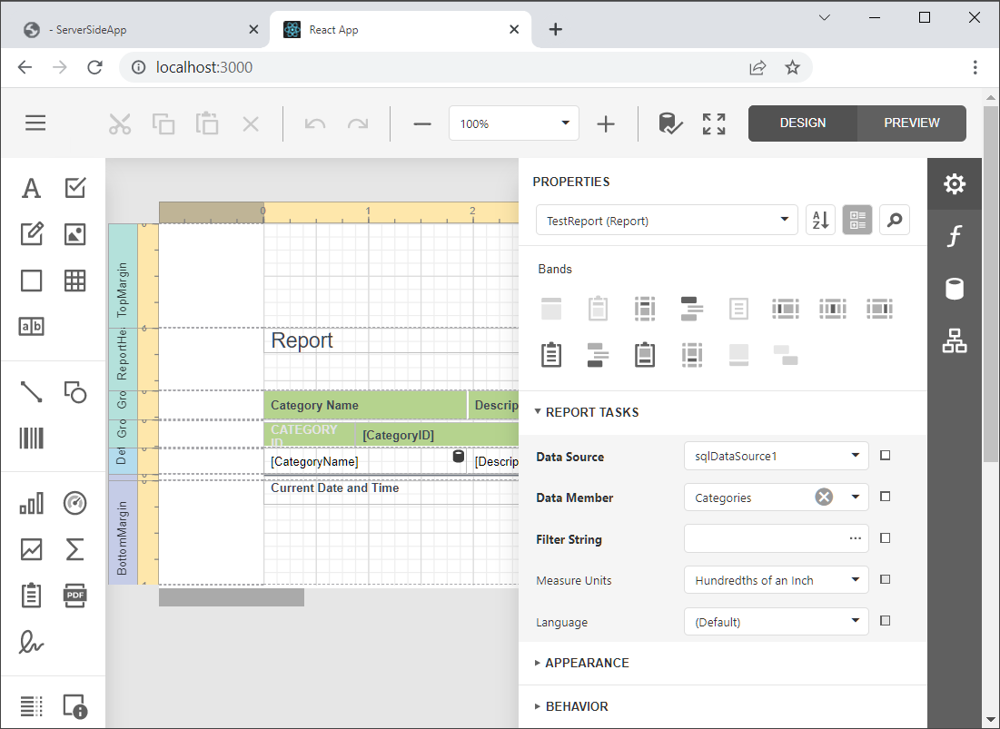

<!-- default badges list -->

[](https://supportcenter.devexpress.com/ticket/details/T848271)
[](https://docs.devexpress.com/GeneralInformation/403183)
[](#does-this-example-address-your-development-requirementsobjectives)
<!-- default badges end -->
# Reporting for React - Add a Web Report Designer to a React App (Vite)

This example incorporates the Web Report Designer into a client-side app built with React. The example consists of two parts:

- The [ServerApp](ServerApp) folder contains the backend project. The project is an ASP.NET Core application that enables [cross-domain requests (CORS)](https://developer.mozilla.org/en-US/docs/Web/HTTP/CORS) (Access-Control-Allow-Origin) and implements custom web report storage.

- The [react-report-designer](react-report-designer) folder contains the client application built with React.

## Quick Start

### Server

In the *ServerApp* folder, run the following command:

```
dotnet run
```

The server starts at http://localhost:5000. To debug the server, run the application in Visual Studio.

### Client

In the *react-report-designer* folder, run the following commands:

```
npm install
npm run dev
```

Open your browser and navigate to the URL specified in the command output to see the result. The application displays the Web Report Designer.




## Files to Review

- [App.tsx](react-report-designer/src/App.tsx)
- [Program.cs](ServerApp/Program.cs)
- [ReportingControllers.cs](ServerApp/Controllers/ReportingControllers.cs)

## Documentation
- [Create a React Application with Web Report Designer](https://docs.devexpress.com/XtraReports/405327)

## More Examples

* [Reporting for React - Integrate Document Viewer in React App](https://github.com/DevExpress-Examples/reporting-react-integrate-web-document-viewer)

<!-- feedback -->
## Does This Example Address Your Development Requirements/Objectives?

[](https://www.devexpress.com/support/examples/survey.xml?utm_source=github&utm_campaign=reporting-react-integrate-end-user-designer&~~~was_helpful=yes) [](https://www.devexpress.com/support/examples/survey.xml?utm_source=github&utm_campaign=reporting-react-integrate-end-user-designer&~~~was_helpful=no)

(you will be redirected to DevExpress.com to submit your response)
<!-- feedback end -->
