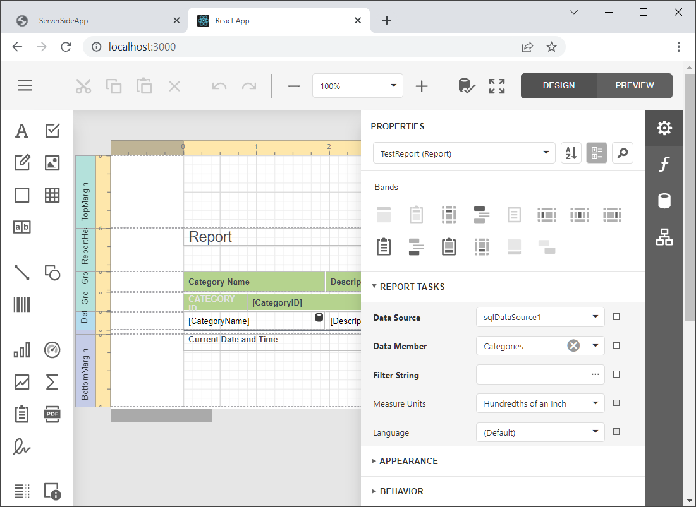

# Reporting for Web (React) - Report Designer

This example consists of two parts:

- A server (back-end) ASP.NET Core project that enables [cross-domain requests (CORS)](https://developer.mozilla.org/en-US/docs/Web/HTTP/CORS) (Access-Control-Allow-Origin) and implements a custom web report storage.

- A React JavaScript Library front-end client application.

Perform the following steps to run this example:

1. Open the back-end project solution (**CS/ServerSideApp.sln**) in Visual Studio and run the project.
2. Navigate to the **JS/react-report-designer** folder that is the client part's root folder.
3. Open the console and run the following command:

    ```npm install```

4. Run the command to compile and start the client part:

    ```npm start```

5. The client application opens the browser at http://localhost:3000/. It displays the **Report Designer** with the **TestReport** report.

    

## Files to Review

- [App.js](JS/react-report-designer/src/App.js)

## Documentation

- [Report Designer Integration in React](https://docs.devexpress.com/XtraReports/119339)

## More Examples

- [Reporting for Web (React) - Document Viewer](https://github.com/DevExpress-Examples/reporting-document-viewer-in-javascript-with-react).
